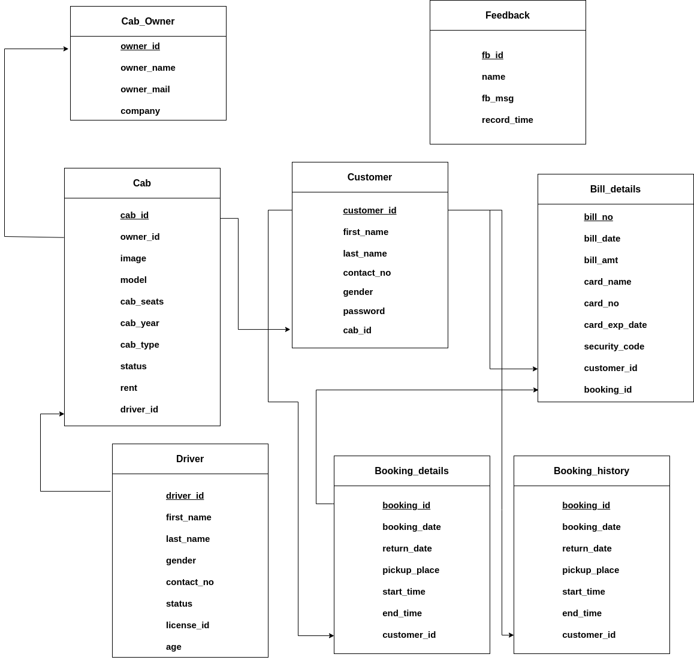

# Cab Booking System
## Problem Statement  
  The problem statement of our project is to develop an online process of Cab
Booking Service. Currently, customers need to make a manual call in order
to rent / reserve a preferred cab. The project will check their database to see
which cab is available for rental.

## Functional Requirements:
1. Our System will have two main authorities: Admin, Customer,
2. By using correct authentication the admin will add the cabs and
drivers in the system and fill all their details accordingly.
3. Initially Cab will be associated with one driver, and the associated
driver’s status will be changed to booked from available and
remaining drivers will be available. And after any customer books that
cab then the cab's status will change to booked.
4. Customers can book a cab for the desired amount of time .
5. When the time gets over, the status of the cab will be changed to
available and details of that record will be deleted from bookings and
will be updated in the history.
6. And according to specified time, hours will be calculated and from
that hours and car rent, the unique bill will be generated for the
customer.
7. After successfully generating a bill, the customer will pay the bill
online and the customer can see that bill at the end.
8. Customers can give feedback for the service and this feedback will be
shown to admin in the customer service section to do further
improvements in the services.
9. Admin can see all the cab bookings and other records to its dashboard
portal after login and filter the booking according to cabs or driver etc.

## E-R Diagram

## Relational Schema

